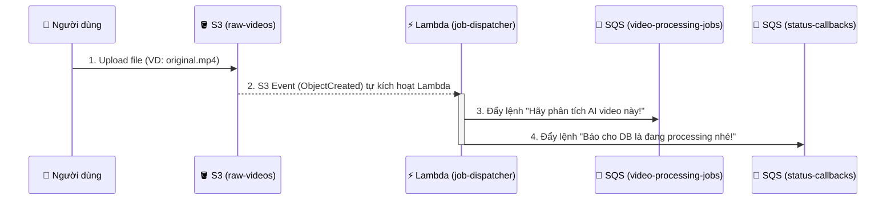
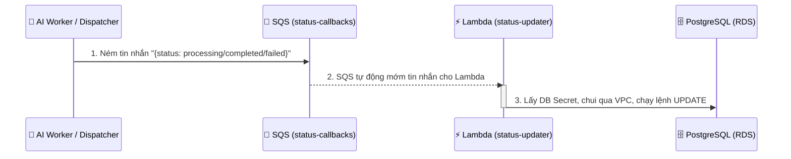
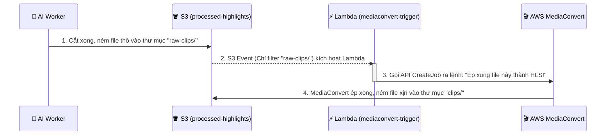

# Kiến Trúc và Luồng Xử Lý Của Module Messaging

Module `messaging` mà bạn vừa triển khai chính là "Hệ thần kinh giao tiếp" của toàn bộ dự án MatchLens. Nó hoàn toàn hoạt động theo cơ chế **Event-Driven (Hướng sự kiện)** và **Bất đồng bộ (Asynchronous)**.

Dưới đây là bức tranh toàn cảnh về 3 luồng công việc (Workflows) cốt lõi đang chạy thực tế trong module này.

---

## 1. Luồng 1: Xử Lý Video Gốc (Job Dispatcher Flow)
Luồng này được kích hoạt ngay khi người dùng (hoặc Backend) tải thành công một file video gốc lên bucket `raw-videos`.

**Chi tiết các Service:**
- **S3 Event Trigger:** Theo dõi bucket. Cứ có file rớt vào là gọi Lambda dậy ngay lập tức.
- **Lambda `job-dispatcher`:** Đóng vai trò làm "Người điều phối". Nó không tự phân tích AI (vì rất nặng), nó chỉ tóm lấy thông tin file vừa upload và nhét thành một tin nhắn (Message) rồi ném vào hàng đợi. Nó hoàn toàn không biết kết nối tới Database.
- **SQS `video_processing_jobs`:** Hàng đợi chứa các tờ lệnh. Nó cứ giữ lệnh ở đó cho đến khi con AI Worker (thuộc module `compute` sắp làm tới) rảnh rỗi chạy đến bốc ra xử lý.

---

## 2. Luồng 2: Cập Nhật Trạng Thái (Status Updater Flow)
Bởi vì Job Dispatcher và AI Worker không có quyền chọc vào Database (để bảo mật), mọi hành động muốn đổi trạng thái của Match đều phải gửi thư qua luồng này.

**Chi tiết các Service:**
- **SQS `status-callbacks`**: Hòm thư chuyên nhận báo cáo tiến độ. Bất cứ ai muốn update DB đều thả thư vào đây. Nó đi kèm một **DLQ (Dead Letter Queue)** - nếu thư bị lỗi không đọc được, nó sẽ bị ném vào DLQ để không làm kẹt hàng đợi.
- **Lambda `status-updater`**: Đây là **Thành phần Compute duy nhất ngoài Backend** có quyền lấy Mật khẩu Database (SecretManager) và có dây mạng chọc thẳng vào vùng Kín (Private Subnet) của RDS. Nhiệm vụ của nó là bóc thư từ SQS ra và chạy lệnh UPDATE SQL.

---

## 3. Luồng 3: Tự Động Transcode Video (MediaConvert Trigger Flow)
Luồng này phục vụ cho việc tạo ra những đoạn cắt highlight nhẹ, mượt để có thể phát trực tiếp trên Web/App.

**Chi tiết các Service:**
- **S3 Event Trigger (có `filter_prefix = "raw-clips/"`)**: Ở đây sự thiên tài của kiến trúc bộc lộ. Bucket này chứa cả file thô và file xịn. Nhờ cái filter này, Lambda chỉ thức dậy khi có file thô rơi vào thư mục `raw-clips/`.
- **Lambda `mediaconvert-trigger`**: Đóng vai trò cầm cái remote bấm nút khởi động máy MediaConvert.
- **AWS MediaConvert**: Cỗ máy ép xung xịn xò của AWS. Nó sẽ lấy file thô từ `raw-clips/`, làm phép thuật, và nhả file xịn ra thư mục `clips/`. Vì file xịn rớt vào thư mục `clips/`, nó không vi phạm cái filter của S3 Event, nên Lambda không bị gọi dậy nữa (tránh được vòng lặp vô hạn gây cháy túi tiền).

---

### 💡 Tổng kết
Module `messaging` này chính là đỉnh cao của thiết kế **Decoupling** (Tách rời các thành phần). Không ai phải đợi ai. Bạn vừa thiết lập xong một hệ thống băng chuyền tự động hoàn hảo, nơi mỗi con Lambda chỉ làm đúng 1 việc nhanh gọn rồi đi ngủ, đảm bảo hiệu suất cực cao và chi phí cực rẻ (gần như miễn phí theo AWS Free Tier)!
